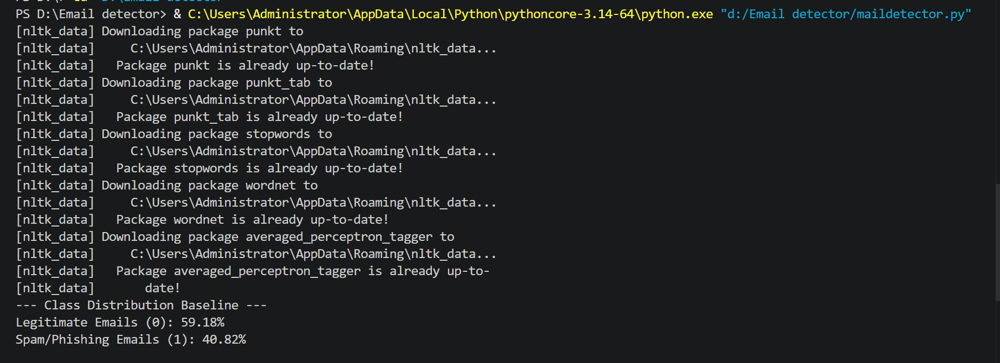
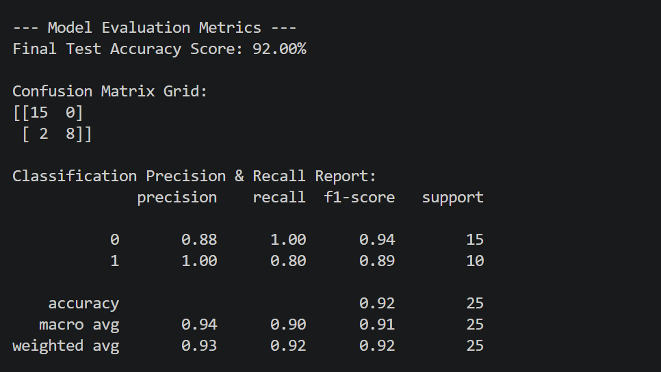

# Automated ML Phishing Detector 
Developed an end-to-end NLP pipeline using Naive Bayes to automatically classify and block email-based threat payloads. Optimized the classifier using a strict train/test split to eliminate data leakage, achieving a 92% detection accuracy rate.

[Download the Phishing Dataset (CSV)](messages.csv)
